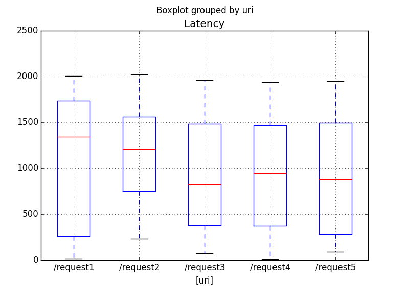
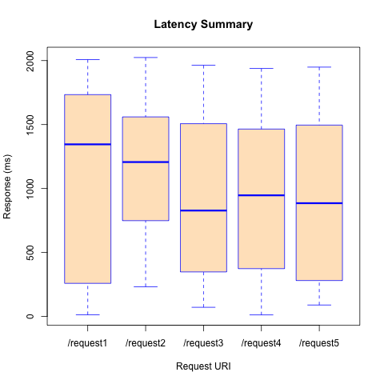
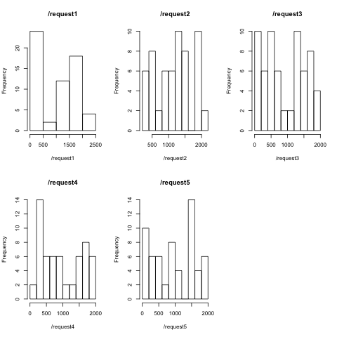

DataPower Latency Stats
=======================

This repository is a companion repository to the
[DataPower Latency Log Entry Analyzer](https://github.com/pglezen/dpShowLatency).
Whereas the log analyzer inspects individual DP latency statements,
this stats repository addresses statistical exploratory analysis on a 
collection of log entries.

The first step is to get the lateny log entries into a form amenable to
most statistical analysis software.  One normally can't go wrong with CSV
files and that's what we do here - with [Python](https://www.python.org).
This repository comes with a sample raw latency file
[sample6.log](sample6.log) on which you can test the code.
Note that this log contains entries from a MultiProtocol Gateway (MPGW).
Web Service Proxy (WSP) look a little different.

Once we have the data as a CSV file, there are a number of exploratory
routes we can take.  In this sample we demonstrate reading the results
into a data frame and creating 
[boxplots](https://en.wikipedia.org/wiki/Box_plot)
categorized by URI.  This is
demonstrated in both [R](https://www.r-project.org/) and
[Pandas](http://pandas.pydata.org).

## Python and Pandas ##

The Python/Pandas demo can be viewed end-to-end using a Jupyter notebook
viewer.  Fortunately, GitHub happens to have a very good one embedded
natively (be sure your JavaScript is enabled).  Just click on the link
for [DPLatency.ipynb](DPLatency.ipynb).

Reading in the CSV and making a box plot is pretty easy as demonstrated
in [latencyBoxplot.py](latencyBoxplot.py).

```python
import pandas as pd
from matplotlib import pyplot as plt

# Read in the CSV data and make a new 'Latency' column
# containing the maximum of the 16 measurement columns.
#
df1 = pd.read_csv('sample6.csv', parse_dates=['Time'])
df1['Latency'] = df1.loc[:,'1':'16'].apply(max, axis=1)

# Make a boxplot of Latencies by URI.
df1.boxplot(column='Latency', by=['uri'])
plt.show()
```

This creates the figure saved in [sample6PyPlot.png](sample6PyPlot.png).




## R and Base Plot ##

R can also produce a boxplot with just a few lines.
The code below comes from [latencyBoxplot.R](latencyBoxplot.R).

```R

# Read in the CSV data.
df <- read.csv('sample6.csv', stringsAsFactors=F)

# Make a latency column containing the maximum of the
# 16 measurement colummns: X1, X2, ..., X16.
#
latencyColumns <- paste(rep('X',16), 1:16, sep='')
df['Latency']  <- apply(df[,latencyColumns], 1, max)

# Send a boxplot to sample6RPlot.png.
#
png(file='sample6RPlot.png')
boxplot(df$Latency ~ df$uri, col='bisque', border='blue',
        xlab='Request URI', ylab='Response (ms)', main='Latency Summary')
dev.off()
```

This R sample produced the plot in [sample6RPlot.png](sample6RPlot.png).



How significant are the differences in medians listed on the boxplots?  
They did, after all, come from the same distribution.  Let's see what
ANOVA has to say.

```
> latency.lm <- lm(Latency ~ uri, data=df)
> anova(latency.lm)
Analysis of Variance Table

Response: Latency
           Df    Sum Sq Mean Sq F value Pr(>F)
uri         4   2316107  579027  1.4928 0.2043
Residuals 295 114421644  387870
```

The F value is pretty low, which means, as we should expect, that these
differences are **not** significant.

Note the ANOVA "sniffed this out" despite the fact that the ANOVA
assumptions were poorly fulfilled.  In particular, the variance within
each group was not normal (I used a JMeter uniform distribution sampler).
The Shapiro-Wilk normality test applied to each uri gives the following.

```
> tapply(residuals(latency.lm), df$uri, shapiro.test)
$`/request1`

	Shapiro-Wilk normality test

data:  X[[i]]
W = 0.85181, p-value = 3.447e-06


$`/request2`

	Shapiro-Wilk normality test

data:  X[[i]]
W = 0.94034, p-value = 0.006704


$`/request3`

	Shapiro-Wilk normality test

data:  X[[i]]
W = 0.91738, p-value = 0.000387


$`/request4`

	Shapiro-Wilk normality test

data:  X[[i]]
W = 0.91801, p-value = 0.0007981


$`/request5`

	Shapiro-Wilk normality test

data:  X[[i]]
W = 0.91067, p-value = 0.0003297
```

I didn't expect such high Shapiro-Wilk scores for distributions
which are clearly not normal, much less with such extreme p-values.
Check out the histograms that I produced with

```R
laturi <- split(df$Latency, dfuri)
for (uriStr in names(laturi)) {
  hist(laturi[[uriStr]], main=uriStr, xlab=uriStr)
}
```



Perhaps this is because of the small data sample.  I intend to
run this experiment later with 1,000s of samples rather than
just a few dozen.
